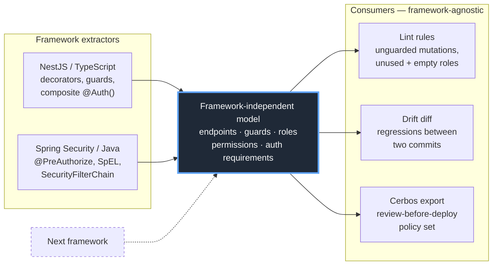

# sphinxor

**Static analysis for your app's authorization model — audit RBAC/ABAC across frameworks, and catch permission drift before it ships.**

*The drift detector for your authorization model: design, audit and document what your code actually enforces.*


```console
$ sphinxor lint ./pharmacy-backend
Analyzing ./pharmacy-backend as spring (detected), 5 source file(s).
# RBAC Matrix

8 endpoint(s), 1 finding(s): 0 blocking, 1 warning, 0 allowlisted.

## Endpoints

| Method | Path | Handler | Controller | Guards | Roles | Findings |
|---|---|---|---|---|---|---|
| GET | /api/customers | getAll | CustomerController | - | ADMIN, PHARMACIST | - |
| POST | /api/customers | create | CustomerController | - | ADMIN, PHARMACIST | - |
| DELETE | /api/customers/{id} | delete | CustomerController | - | ADMIN | - |
| GET | /api/customers/{id} | get | CustomerController | - | ADMIN, PHARMACIST | - |
| PUT | /api/customers/{id} | update | CustomerController | - | ADMIN, PHARMACIST | - |
| GET | /api/suppliers | getAll | SupplierController | - | ADMIN, PHARMACIST | - |
| POST | /api/suppliers | create | SupplierController | - | ADMIN | - |
| POST | /auth/login | login | AuthController | - | - | mutating-endpoint-without-access-control |

## Findings

- [LOW/warning] `mutating-endpoint-without-access-control`: POST /auth/login has no detected guard or role decorator
```

**Sphinxor's output is Markdown — it drops straight into your docs or PR.** That same run renders as:

### RBAC Matrix

8 endpoint(s), 1 finding(s): 0 blocking, 1 warning, 0 allowlisted.

| Method | Path | Handler | Controller | Guards | Roles | Findings |
|---|---|---|---|---|---|---|
| GET | /api/customers | getAll | CustomerController | - | ADMIN, PHARMACIST | - |
| POST | /api/customers | create | CustomerController | - | ADMIN, PHARMACIST | - |
| DELETE | /api/customers/{id} | delete | CustomerController | - | ADMIN | - |
| GET | /api/customers/{id} | get | CustomerController | - | ADMIN, PHARMACIST | - |
| PUT | /api/customers/{id} | update | CustomerController | - | ADMIN, PHARMACIST | - |
| GET | /api/suppliers | getAll | SupplierController | - | ADMIN, PHARMACIST | - |
| POST | /api/suppliers | create | SupplierController | - | ADMIN | - |
| POST | /auth/login | login | AuthController | - | - | `mutating-endpoint-without-access-control` |

*(Real output, from a real open-source Spring project.)*

The matrix is the inventory: every role referenced at each endpoint. Where two authorization layers disagree, Sphinxor computes the **effective** policy — `GET /api/suppliers` lists `ADMIN, PHARMACIST` from its `@PreAuthorize`, but a `SecurityFilterChain` rule narrows the URL to `ADMIN`, so the exported policy grants `ADMIN` alone:

```yaml
# cerbos-policies/supplier.yaml — method {ADMIN, PHARMACIST} ∩ URL {ADMIN}
    - actions: ["get"]
      roles:
        - "ADMIN"
      effect: EFFECT_ALLOW
```

`--format json` gives you the same model for tooling.

## The problem

Teams build roles and permissions incrementally — a guard here, a decorator there, a filter chain somewhere else. Over time nobody can answer "who can actually call this endpoint?" without reading the code, and the answer drifts from whatever the spec said six months ago. The authorization model exists, but only implicitly, scattered across annotations and config.

Generic SAST tools don't close this gap. Semgrep, CodeQL, and SonarQube pattern-match for known-bad shapes; they never build an explicit model of *who may do what*, so they can't tell you a role is unused, that an endpoint lost its guard in last week's refactor, or that two authorization layers combine to something narrower than either one suggests. Sphinxor inverts that: it reconstructs the authorization model first, then reasons over it. **The model is the product; finding problems is a consequence of having one.**

## Architecture

Every framework extractor produces the *same* framework-independent model. Everything downstream — lint rules, drift detection, policy export — consumes only that model and never touches framework-specific code.



That convergence is a design claim, so adding the second framework was treated as its test rather than an assumption — and the honest result is recorded, not rounded up. Absorbing Spring took four **additive** model changes (nothing reshaped or removed). The drift-diff engine then ran on Spring output with **zero** changes. The lint rules and the Cerbos exporter needed targeted corrections — each one its own ADR ([0015](docs/decisions/0015-inert-method-security-guard.md), [0017](docs/decisions/0017-declaresroles-excludes-isauthenticated.md), and the two-layer intersection in [0012](docs/decisions/0012-securityfilterchain-effective-policy.md)) — not redesign.

A new framework means a new extractor plus whatever the model genuinely lacks, found by building it rather than predicted in advance.

## What it does

- **Analyzes NestJS (TypeScript) and Spring Security (Java)** — endpoints, guards, roles, and permissions, with the framework auto-detected from your source (`--framework` to override). The Spring extractor targets Spring Security specifically, not authorization in Spring applications generally: [ADR 0029](docs/decisions/0029-spring-security-scope.md) lists every mechanism and its status.
- **Drift detection in CI — the differentiator.** `sphinxor diff <base> <head>` compares two checkouts and fails the build on a *regression*: an endpoint that had access control in the base and has none in the head, a new blocking finding, or a blocking finding whose `sphinxor-allow` exemption was removed. Point-in-time scanning can't see any of them. Pre-existing findings don't re-fail every subsequent PR, and an endpoint made public deliberately doesn't fail it at all if you mark it. What gates, exactly, is [ADR 0036](docs/decisions/0036-became-public-gates-ci.md) §1 — including what it deliberately does *not* catch, such as a privilege widened from `ADMIN` to `USER`.
- **Three lint rules**: mutating endpoint with no detected access control, permission declared but never referenced, empty role.
- **Cerbos policy export** — generates a Cerbos resource policy set from the extracted model, validated against the real `cerbos compile`. Explicitly marked review-before-deploying.
- **Combines authorization layers.** For Spring Security, the exported policy intersects method-level annotations with `SecurityFilterChain` URL rules, so it reflects the effective permission rather than either layer alone.
- **`// sphinxor-allow:` suppression** for endpoints that are public on purpose — with a finding when a marker no longer matches anything, so exemptions can't rot silently.
- **Confidence-graded findings.** `High` fails CI; `Low` is a warning. Nothing is reported as a certainty that isn't one.

Current scope, stated plainly: **two frameworks, one export target.** Known blind spots are documented in [`docs/limitations.md`](docs/limitations.md) rather than left for you to discover.

## Install

```sh
go install github.com/chebilax/sphinxor/cmd/sphinxor@latest
```

Or download a prebuilt binary:

```sh
# macOS (Apple Silicon)
curl -fsSL https://github.com/chebilax/sphinxor/releases/download/v0.8.0/sphinxor_v0.8.0_darwin_arm64.tar.gz | tar -xz sphinxor

# Linux (x86-64)
curl -fsSL https://github.com/chebilax/sphinxor/releases/download/v0.8.0/sphinxor_v0.8.0_linux_amd64.tar.gz | tar -xz sphinxor
```

Windows builds are on the [releases page](https://github.com/chebilax/sphinxor/releases).

## Quickstart

```sh
# Audit a project (framework auto-detected)
sphinxor lint ./my-app

# Machine-readable output
sphinxor lint ./my-app --format json

# Fail CI on an authorization regression vs. the base branch
git worktree add ../base origin/main
sphinxor diff ../base .

# Export a Cerbos policy set (review before deploying)
sphinxor export cerbos ./my-app --out cerbos-policies
```

## Engineering approach

The decisions behind this project are written down, in [`docs/decisions/`](docs/decisions/) — **19 ADRs**, each recording the alternatives considered and why they were rejected, written *before* the implementing code rather than reconstructed after it.

Three things that shaped the codebase more than any feature did:

- **Validated against real repositories, not fixtures.** Extraction, linting and export are tested against vendored open-source NestJS and Spring projects, and generated Cerbos policies are checked with the real `cerbos compile` binary in CI. Several bugs surfaced only that way — including one where a generated policy rule would have silently governed an endpoint it was never meant to cover.
- **Safety-first by default: omit and flag, never guess.** When the analysis can't establish something with certainty, it says so instead of assuming. The exporter omits a rule rather than emit one that might over-grant; an unreadable Spring filter-chain rule stops evaluation instead of falling through to a more permissive one; a run that couldn't examine anything is an error, not an empty clean report. **A tool that reassures you incorrectly is worse than one that admits a gap.**
- **Honest about what it can't see.** [`docs/limitations.md`](docs/limitations.md) is a first-class document listing real, measured blind spots — global guards, unresolved composite decorators, custom `AuthorizationManager`s — with what each one costs you.

Further reading: [`docs/vision.md`](docs/vision.md) for scope and positioning, [`docs/testing.md`](docs/testing.md) for what "validated" means here, [`CONTRIBUTING.md`](CONTRIBUTING.md) for the process.

## License

[MIT](LICENSE)
